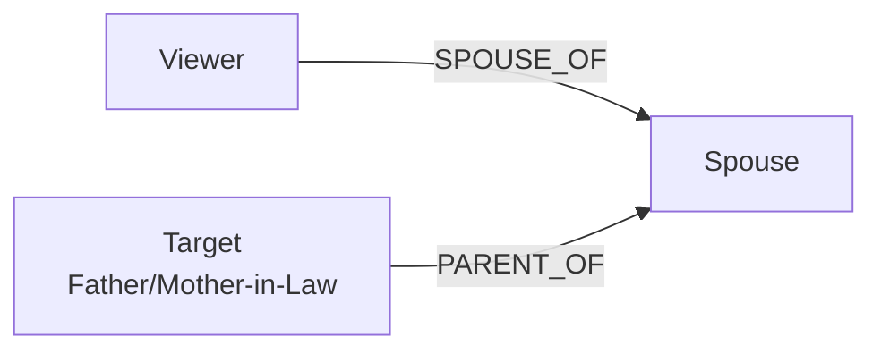

# Add Father-in-Law and Mother-in-Law Relationships

## Overview

Add support for "father-in-law" and "mother-in-law" relationships to the relationship wizard. These relationships require:

- Viewer must have a spouse (SPOUSE_OF relationship)
- Target must be the spouse's parent (PARENT_OF relationship)

## Relationship Logic



**Father-in-law**: The father of one's spouse

- Requires: viewer -> spouse (SPOUSE_OF exists), target -> spouse (PARENT_OF)
- Edge to create: `target -> spouse (PARENT_OF)` if not already exists

**Mother-in-law**: The mother of one's spouse

- Same logic but for mother
- Edge to create: `target -> spouse (PARENT_OF)` if not already exists

## Implementation Steps

### 1. Update Translation Service

**File**: [frontend/src/services/relationshipTranslator.js](family-app/frontend/src/services/relationshipTranslator.js)

- Add helper function `getSpouse(personId, topology)` to find a person's spouse
- Add `'father-in-law'` and `'mother-in-law'` to `INDIRECT_LABELS` array
- Add `'father-in-law'` to `MALE_LABELS` and `'mother-in-law'` to `FEMALE_LABELS`
- Add translation cases in `translateLabel()` function:
  - Check if viewer has a spouse
  - If no spouse, add to `missingPersons` with appropriate message
  - If spouse exists, check if target is already spouse's parent
  - If not, create edge: `target -> spouse (PARENT_OF)`

### 2. Update Relationship Icons

**File**: [frontend/src/components/RelationshipWizard/relationshipIcons.js](family-app/frontend/src/components/RelationshipWizard/relationshipIcons.js)

- Add icon mappings for `father-in-law` and `mother-in-law` (use `ElderlyIcon` or `GroupsIcon`)
- Add display names: `'Father-in-Law'` and `'Mother-in-Law'`
- Add to `relationshipCategories` - create new category `inlaws` or add to `extended`:
  ```javascript
  inlaws: {
    title: 'In-Laws',
    labels: ['father-in-law', 'mother-in-law'],
    color: 'warning', // or 'info'
  }
  ```


### 3. Update StepSelectLabel Component

**File**: [frontend/src/components/RelationshipWizard/StepSelectLabel.jsx](family-app/frontend/src/components/RelationshipWizard/StepSelectLabel.jsx)

- Add tooltip text for in-law relationships:
  - `father-in-law`: "Requires: Viewer → Spouse → Spouse's Father"
  - `mother-in-law`: "Requires: Viewer → Spouse → Spouse's Mother"

### 4. Update Tests

**File**: [frontend/src/tests/unit/relationshipTranslator.test.js](family-app/frontend/src/tests/unit/relationshipTranslator.test.js)

- Add test cases for `translateLabel('father-in-law', ...)`
- Add test cases for `translateLabel('mother-in-law', ...)`
- Test missing spouse scenario
- Test when spouse already has the target as parent
- Test when edge needs to be created

## Code Changes Summary

### Helper Function Needed

```javascript
function getSpouse(personId, topology) {
  // Find SPOUSE_OF edges where personId is either from or to
  const spouseEdge = topology.edges.find(
    e => (e.from === personId || e.to === personId) && e.type === 'SPOUSE_OF'
  );
  if (!spouseEdge) return null;
  // Return the other person in the spouse relationship
  return spouseEdge.from === personId ? spouseEdge.to : spouseEdge.from;
}
```

### Translation Case Example

```javascript
case 'father-in-law':
case 'mother-in-law':
  // Requires: viewer -> spouse -> spouse's parent
  const spouseId = getSpouse(viewerId, topology);
  if (!spouseId) {
    missingPersons.push({
      role: 'spouse',
      message: `To add ${getPersonName(targetId, topology)} as your ${label}, you need a spouse first. Please add your spouse.`
    });
  } else {
    // Check if target is already spouse's parent
    const spouseParents = getParents(spouseId, topology);
    if (!spouseParents.includes(targetId)) {
      // Need to add: target -> spouse (PARENT_OF)
      edges.push({
        from: targetId,
        to: spouseId,
        type: 'PARENT_OF'
      });
    }
  }
  break;
```

## Edge Cases to Handle

1. **Viewer has no spouse**: Show clear error message guiding user to add spouse first
2. **Spouse already has 2 parents**: Check max parents validation for spouse
3. **Target is already spouse's parent**: No edge needed, relationship already exists
4. **Multiple spouses**: Use first spouse found (though typically there's only one)

## Files to Modify

1. `frontend/src/services/relationshipTranslator.js` - Add translation logic
2. `frontend/src/components/RelationshipWizard/relationshipIcons.js` - Add icons and categories
3. `frontend/src/components/RelationshipWizard/StepSelectLabel.jsx` - Add tooltips
4. `frontend/src/tests/unit/relationshipTranslator.test.js` - Add test cases