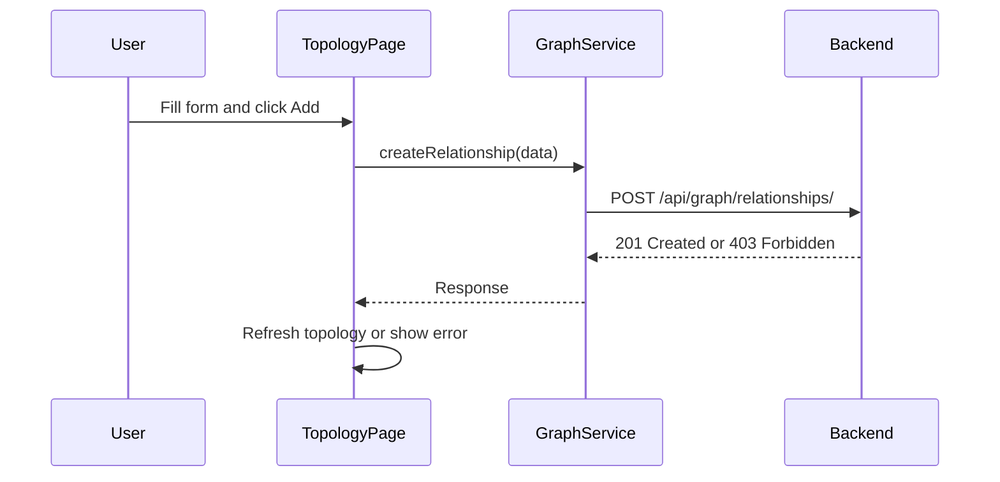

# Add Relationship UI to Topology Page

## Summary

The backend already has the `POST /api/graph/relationships/` endpoint ready. This plan adds frontend support: a service function and a collapsible form on the Topology page.

## Architecture



## Implementation

### 1. Add `createRelationship` to graph service

**File:** [family-app/frontend/src/services/graph.js](family-app/frontend/src/services/graph.js)

Add a new function:

```javascript
export const createRelationship = async ({ familyId, fromPersonId, toPersonId, type }) => {
  const response = await api.post('/api/graph/relationships/', {
    family: familyId,
    from_person: fromPersonId,
    to_person: toPersonId,
    type: type,  // 'PARENT_OF' or 'SPOUSE_OF'
  });
  return response.data;
};
```

### 2. Add relationship form to Topology page

**File:** [family-app/frontend/src/pages/Topology.jsx](family-app/frontend/src/pages/Topology.jsx)

Add a new Card with:

- "From Person" dropdown (select from existing persons)
- "To Person" dropdown (select from existing persons)
- "Relationship Type" dropdown (PARENT_OF, SPOUSE_OF)
- "Add Relationship" button
- Success/error handling with snackbar or alert
- On success: refetch topology to show the new relationship

Key UI behaviors:

- Disable "to_person" dropdown until "from_person" is selected
- Prevent selecting the same person for both
- Show loading spinner while submitting
- If backend returns 403, show "Only family admins can create relationships"

### 3. Imports to add

Add to Topology.jsx imports:

- `Button` from MUI
- `createRelationship` from services/graph