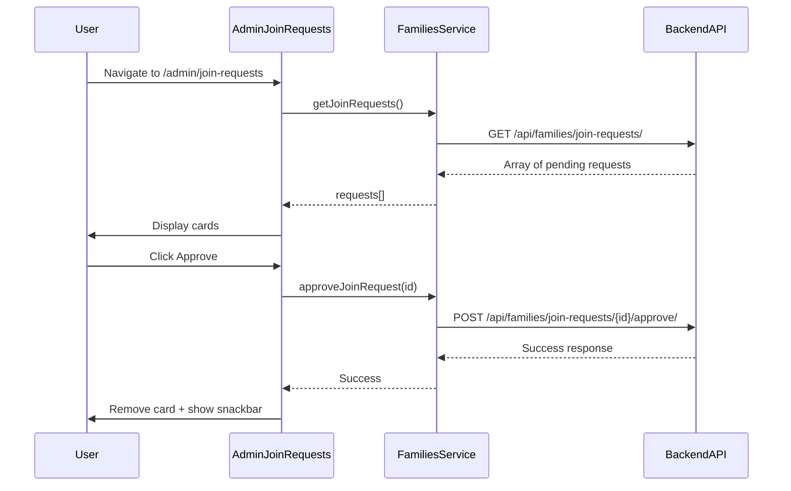

# Admin Join Requests Page

## Overview

Create a new admin page at `/admin/join-requests` that allows family admins to view and approve/reject pending join requests. The backend endpoints already exist.

## 1. Add Service Functions

**File:** [family-app/frontend/src/services/families.js](family-app/frontend/src/services/families.js)

Add three new functions following the existing pattern:

```javascript
export const getJoinRequests = async () => {
  const response = await api.get('/api/families/join-requests/');
  return response.data;
};

export const approveJoinRequest = async (id) => {
  const response = await api.post(`/api/families/join-requests/${id}/approve/`);
  return response.data;
};

export const rejectJoinRequest = async (id) => {
  const response = await api.post(`/api/families/join-requests/${id}/reject/`);
  return response.data;
};
```

## 2. Create AdminJoinRequests Page

**File:** `family-app/frontend/src/pages/AdminJoinRequests/index.jsx` (new)

The page will:
- Fetch pending join requests on mount using `getJoinRequests()`
- Display requests as MUI Cards showing:
  - Requester username (`requested_by`)
  - Family name (`family.name`)
  - Person details: either `chosen_person_id` or `new_person_payload` (first_name, last_name, dob, gender)
  - Request date (`created_at`)
- Include Approve/Reject buttons with individual loading states
- Remove card from list after successful action
- Show Snackbar feedback for success/error

**Response structure** from API (per `JoinRequestListSerializer`):
```json
{
  "id": 1,
  "family": { "id": 1, "name": "Smith Family", "code": "ABC12345" },
  "requested_by": "johndoe",
  "chosen_person_id": null,
  "new_person_payload": { "first_name": "John", "last_name": "Doe", "dob": "1990-01-01", "gender": "MALE" },
  "status": "PENDING",
  "created_at": "2026-01-13T10:00:00Z"
}
```

## 3. Add Route

**File:** [family-app/frontend/src/App.jsx](family-app/frontend/src/App.jsx)

Add new route inside the protected AppShell routes:

```jsx
<Route path="admin/join-requests" element={<AdminJoinRequests />} />
```

## 4. Add Navbar Link

**File:** [family-app/frontend/src/components/AppShell.jsx](family-app/frontend/src/components/AppShell.jsx)

Add a "Join Requests" button in the navbar. Since we cannot easily determine admin status from the current context without an extra API call, we'll show the link to all authenticated users - the page will gracefully handle empty responses when the user is not an admin of any family.

```jsx
<Button color="inherit" component={Link} to="/admin/join-requests">
  Join Requests
</Button>
```

## Data Flow

