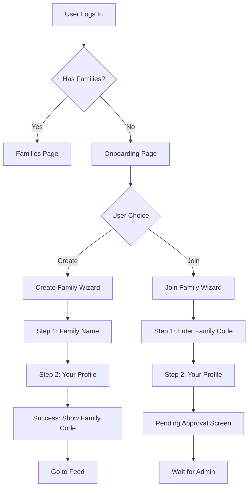

# Family Onboarding Flow Plan

## Current State

- Users login via `/login` and are redirected to `/families`
- The [Families.jsx](family-app/frontend/src/pages/Families.jsx) page shows "You don't belong to any families yet" with no action buttons
- Backend already supports: `POST /api/families/` (create), `POST /api/families/join/` (join request)
- Join requests require admin approval via existing flow

## User Journey



## Implementation Details

### 1. Frontend: New Onboarding Page

Create a new page at `family-app/frontend/src/pages/Onboarding/Onboarding.jsx`:

- **Welcome Screen**: Two prominent cards - "Create a Family" and "Join a Family"
- **Create Family Wizard** (2 steps):
  - Step 1: Enter family name
  - Step 2: Enter personal info (first name, last name, optional DOB, gender)
  - Success: Display generated family code with copy button
- **Join Family Wizard** (2 steps):
  - Step 1: Enter 8-character family code
  - Step 2: Enter personal info (will be sent as `new_person_payload`)
  - Pending: Show confirmation that request is awaiting admin approval

UI Components to use: MUI Stepper, Card, TextField, Button, Alert

### 2. Frontend: API Service Functions

Add to `family-app/frontend/src/services/families.js`:

```javascript
// Create a new family
export const createFamily = async (name) => {
  const response = await api.post('/api/families/', { name });
  return response.data;
};

// Submit join request
export const submitJoinRequest = async (code, newPersonPayload) => {
  const response = await api.post('/api/families/join/', {
    code,
    new_person_payload: newPersonPayload
  });
  return response.data;
};
```

### 3. Frontend: Update Protected Route

Modify [ProtectedRoute.jsx](family-app/frontend/src/routes/ProtectedRoute.jsx):

- After authentication check, fetch families
- If user has 0 families, redirect to `/onboarding`
- Add `/onboarding` to App routes

### 4. Frontend: Pending Status Page

Create `family-app/frontend/src/pages/Onboarding/PendingApproval.jsx`:

- Show message: "Your request to join [Family Name] is pending approval"
- Display request status
- Option to check status or logout
- Consider polling or manual refresh for status updates

### 5. Backend: Add Endpoint for User's Join Requests

Add new endpoint to check pending join requests in [views.py](family-app/backend/apps/families/views.py):

```python
# GET /api/families/my-join-requests/
class MyJoinRequestsView(APIView):
    """List join requests made by the current user"""
    def get(self, request):
        join_requests = JoinRequest.objects.filter(
            requested_by=request.user
        ).select_related('family')
        # Return list with status
```

Add URL in [urls.py](family-app/backend/apps/families/urls.py).

### 6. Backend: Person Profile on Family Creation

Modify `create_family_with_membership` in [family_service.py](family-app/backend/apps/families/services/family_service.py) to accept optional person profile data (first_name, last_name, dob, gender) instead of deriving from username.

## File Changes Summary

| File | Action |
|------|--------|
| `frontend/src/pages/Onboarding/Onboarding.jsx` | Create (main wizard) |
| `frontend/src/pages/Onboarding/PendingApproval.jsx` | Create (pending screen) |
| `frontend/src/pages/Onboarding/index.js` | Create (exports) |
| `frontend/src/services/families.js` | Update (add createFamily, submitJoinRequest) |
| `frontend/src/routes/ProtectedRoute.jsx` | Update (redirect to onboarding) |
| `frontend/src/App.jsx` | Update (add /onboarding route) |
| `backend/apps/families/views.py` | Update (add MyJoinRequestsView) |
| `backend/apps/families/urls.py` | Update (add my-join-requests endpoint) |
| `backend/apps/families/serializers.py` | Update (add serializer for family creation with person) |
| `backend/apps/families/services/family_service.py` | Update (accept person profile data) |