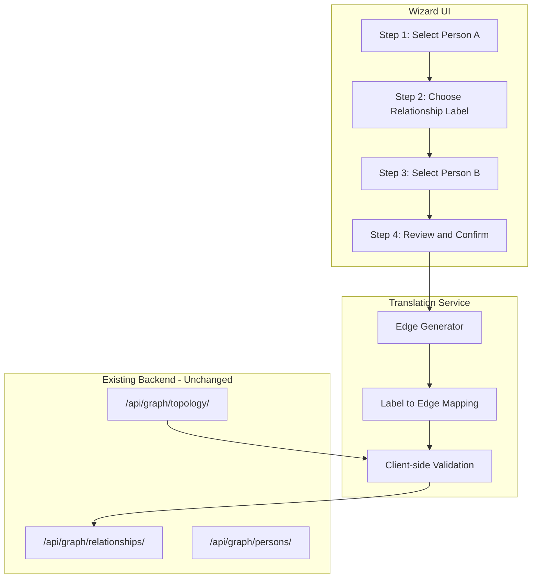
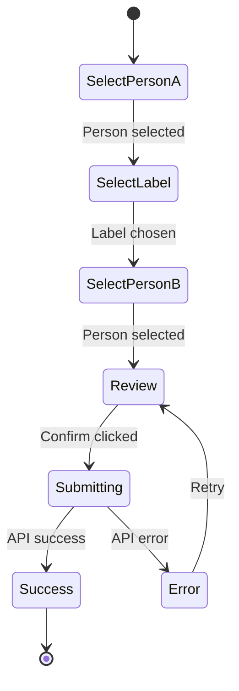

# Relationship Wizard Feature

## Architecture Overview



## 1. Translation Service

Create [frontend/src/services/relationshipTranslator.js](family-app/frontend/src/services/relationshipTranslator.js) with the following:

### Supported Labels and Edge Mappings

| User Label | Edge Direction | Edge Type | Notes |
|------------|----------------|-----------|-------|
| father/mother | target -> viewer | PARENT_OF | Reverse direction |
| son/daughter | viewer -> target | PARENT_OF | Forward direction |
| husband/wife/spouse | viewer <-> target | SPOUSE_OF | Bidirectional (backend handles) |
| brother/sister | (indirect) | PARENT_OF | Requires shared parent |
| grandfather/grandmother | (indirect) | PARENT_OF x2 | Via parent chain |
| grandson/granddaughter | (indirect) | PARENT_OF x2 | Via child chain |
| uncle/aunt | (indirect) | PARENT_OF | Parent's sibling |
| nephew/niece | (indirect) | PARENT_OF | Sibling's child |
| cousin | (indirect) | PARENT_OF x4 | Via grandparent |

### Core Functions

```javascript
// Categorize labels by complexity
const DIRECT_LABELS = ['father', 'mother', 'son', 'daughter', 'husband', 'wife', 'spouse'];
const INDIRECT_LABELS = ['brother', 'sister', 'grandfather', 'grandmother', ...];

// translateLabel(label, viewerId, targetId, topology) -> { edges: [], missingPersons: [] }
// validateRelationship(viewerId, targetId, label, topology) -> { valid: boolean, errors: [] }
// getAvailableLabels(viewerId, targetId, topology) -> string[]
```

### Validation Rules (Client-Side)

- No self-relations: `viewerId !== targetId`
- Max 2 parents: Check topology edges before adding parent
- Gender consistency: Warn if label doesn't match person's gender
- Duplicate check: Prevent creating existing relationships

## 2. Wizard UI Component

Create [frontend/src/components/RelationshipWizard/](family-app/frontend/src/components/RelationshipWizard/) with:

### File Structure

```
components/RelationshipWizard/
  index.jsx           # Main wizard component with stepper
  StepSelectPerson.jsx    # Person selection with search/filter
  StepSelectLabel.jsx     # Visual label picker with categories
  StepReview.jsx          # Preview edges to be created
  relationshipIcons.js    # Icon mappings for labels
```

### Step 1: Select First Person

- Dropdown or card grid of family members
- Show existing relationships for context
- Option to use "yourself" (logged-in user's person)

### Step 2: Choose Relationship Label

Visual picker with categories:

```
Direct Family
  [Father] [Mother] [Son] [Daughter]
  
Spouse
  [Husband] [Wife] [Spouse]
  
Extended Family  
  [Brother] [Sister] [Grandfather] [Grandmother]
  [Uncle] [Aunt] [Nephew] [Niece] [Cousin]
```

- Gray out invalid options based on topology (e.g., max parents reached)
- Show tooltips explaining what edges will be created

### Step 3: Select Second Person

- Filter persons based on label selected (e.g., for "father", show only males)
- Show which persons already have this relationship
- Validate selection before proceeding

### Step 4: Review and Confirm

- Show human-readable summary: "John will be added as Sarah's father"
- Display the actual edges that will be created
- For indirect relationships, show intermediate steps needed
- Confirm button calls translation service then API

### Wizard States



## 3. Integration with Existing Topology Page

Modify [frontend/src/pages/Topology.jsx](family-app/frontend/src/pages/Topology.jsx):

- Replace current "Add Relationship" card with "Add Relationship" button
- Button opens RelationshipWizard as a modal/dialog
- Keep existing advanced form as "Advanced Mode" toggle for power users
- After wizard completes, refetch topology to update view

## 4. Handling Indirect Relationships

For relationships that require intermediate edges (uncle, cousin, etc.):

### Option A: Guide User (Recommended for MVP)

Show message: "To add John as your uncle, first add your parent, then add John as their sibling."

### Option B: Create Missing Edges (Future Enhancement)

Wizard detects missing intermediate relationships and offers to create them:
- "John can be your uncle if we first establish that Mary is your mother and John is Mary's brother. Create these relationships?"

## 5. Key Files to Create/Modify

### New Files

- `frontend/src/services/relationshipTranslator.js` - Translation logic
- `frontend/src/components/RelationshipWizard/index.jsx` - Main wizard
- `frontend/src/components/RelationshipWizard/StepSelectPerson.jsx`
- `frontend/src/components/RelationshipWizard/StepSelectLabel.jsx`
- `frontend/src/components/RelationshipWizard/StepReview.jsx`
- `frontend/src/components/RelationshipWizard/relationshipIcons.js`

### Modified Files

- `frontend/src/pages/Topology.jsx` - Add wizard trigger button

## 6. Translation Service Implementation Details

```javascript
// Example: translateLabel for "father"
function translateLabel(label, viewerId, targetId, topology) {
  switch(label) {
    case 'father':
    case 'mother':
      // Target is parent of viewer -> PARENT_OF from target to viewer
      return {
        edges: [{ from: targetId, to: viewerId, type: 'PARENT_OF' }],
        missingPersons: []
      };
    
    case 'son':
    case 'daughter':
      // Viewer is parent of target -> PARENT_OF from viewer to target
      return {
        edges: [{ from: viewerId, to: targetId, type: 'PARENT_OF' }],
        missingPersons: []
      };
    
    case 'husband':
    case 'wife':
    case 'spouse':
      // SPOUSE_OF (backend creates bidirectional)
      return {
        edges: [{ from: viewerId, to: targetId, type: 'SPOUSE_OF' }],
        missingPersons: []
      };
    
    // ... indirect relationships
  }
}
```

## 7. Client-Side Validation Using Topology

```javascript
function validateRelationship(viewerId, targetId, label, topology) {
  const errors = [];
  
  // No self-relation
  if (viewerId === targetId) {
    errors.push('Cannot create relationship to yourself');
  }
  
  // Max 2 parents check
  if (['father', 'mother'].includes(label)) {
    const existingParents = topology.edges.filter(
      e => e.to === viewerId && e.type === 'PARENT_OF'
    );
    if (existingParents.length >= 2) {
      errors.push('Person already has 2 parents');
    }
  }
  
  // Duplicate check
  const wouldDuplicate = checkDuplicate(viewerId, targetId, label, topology);
  if (wouldDuplicate) {
    errors.push('This relationship already exists');
  }
  
  return { valid: errors.length === 0, errors };
}
```