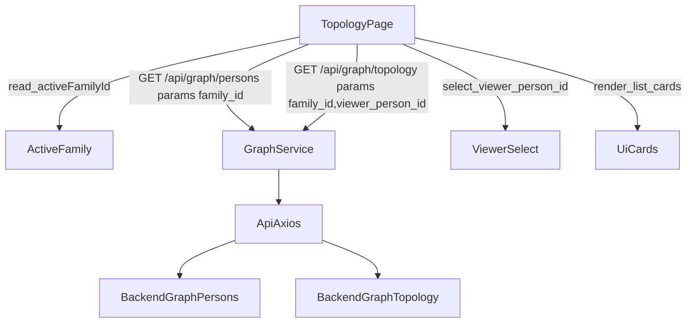

## Scope (only these files)
- [family-app/frontend/src/pages/Topology.jsx](family-app/frontend/src/pages/Topology.jsx)
- [family-app/frontend/src/services/graph.js](family-app/frontend/src/services/graph.js)

## Data flow

## Implementation details
- In `frontend/src/services/graph.js`:
  - Add `getPersons({ familyId })` → `api.get('/api/graph/persons/', { params: { family_id: familyId } })`.
  - Add `getTopology({ familyId, viewerPersonId })` → `api.get('/api/graph/topology/', { params: { family_id: familyId, viewer_person_id: viewerPersonId } })`.
  - Return `response.data` from both.

- In `frontend/src/pages/Topology.jsx`:
  - Read `activeFamilyId` primarily from `useFamily()` if available; always have a fallback to `localStorage.getItem('activeFamily')` JSON (`{ activeFamilyId }`).
  - On mount / when `activeFamilyId` changes:
    - Fetch persons list; show loading/error UI.
    - If `viewerPersonId` not set, default it to the first person’s `id`.
  - When `viewerPersonId` changes:
    - Fetch topology; show loading/error UI.
  - Render with MUI:
    - Top card: title + viewer dropdown (`Select`/`MenuItem`).
    - Nodes card: `List` of nodes showing name, `relation_to_viewer`, and optional metadata (`gender`, `dob`).
    - Edges card: `List` of edges rendered as `fromName → toName` + type `Chip`; build an `id → person` map from persons or topology nodes for name lookup.
  - Handle empty states:
    - No family selected → show a helpful `Alert`.
    - No persons → show “No persons yet”.
    - No edges → show “No relationships yet”.

## Notes/assumptions
- Backend response shapes used:
  - Persons: array of `{ id, first_name, last_name, ... }`.
  - Topology: `{ family_id, viewer_person_id, nodes: [...], edges: [{ from, to, type }] }`.
- Auth is already handled by `frontend/src/api/axios.js` attaching `Bearer <token>`.